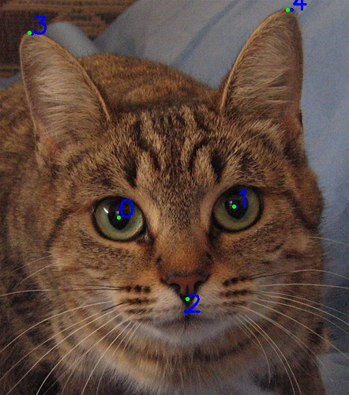
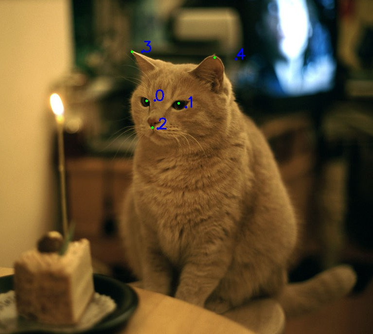
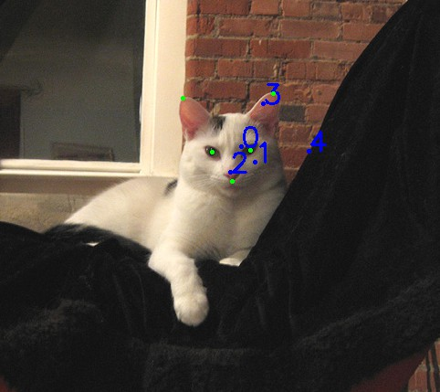
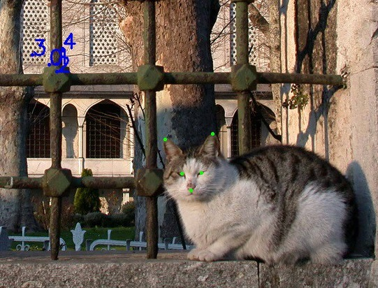

### Introduction

This repo is a fork of https://github.com/kairess/cat_hipsterizer. It contains a cat face
landmark predictor, which I was looking for to use in a project.

I added some routines to assess the performance of the predictor and I made it use
[an improved version of the data](https://github.com/zylamarek/cat-dataset).

The predictor consists of two models stacked on each other. The first one predicts the ROI (bounding box)
and the second one detects landmarks inside the ROI. The detected landmarks are then translated into the original image.
I did a rather limited hyperparameter search and trained both models on the augmented data. All the results below
are based on these two models.

Images below show examples of predicted landmarks (ordered by prediction accuracy, best on the left).
Ground truth landmarks are presented in green and predicted landmarks in blue. Landmarks are labeled: 0 - right eye,
1 - left eye, 2 - mouth, 3 - right ear, 4 - left ear.

[](./images/correct.png)
[](./images/close.png)
[](./images/rotated.png)
[](./images/incorrect.png)

### Results

The RMSE of the whole pipeline is **16.41**, which normalized to the size of the image boils down to **0.04972**.
**It can be interpreted that an average error of each landmark along any axis is around 16 pixels or almost 5% of the image size.**

The first table presents the performance of the whole pipeline. RMSE values are expressed in pixels,
MSE in pixels squared. Normalized values were obtained by dividing RMSE by length of the longer edge of an image.

Whole pipeline | train | validation | test
--- | --- | --- | ---
MSE | 176.24 | 224.97 | 269.25
RMSE | 13.28 | 15.00 | **16.41**
RMSE normalized | 0.01928 | 0.04774 | **0.04972**
RMSE normalized eyes | 0.01244 | 0.03504 | 0.03586
RMSE normalized mouth | 0.01716 | 0.05249 | 0.05173
RMSE normalized ears | 0.02504 | 0.05561 | 0.05964

The table below depicts results of the bounding box (ROI) prediction model. MSE and RMSE were computed for
two points: top-left and bottom-right corner of the bounding box. Intersection over union (IoU) of
the predicted and ground truth boxes is also presented.

Bounding box | train | validation | test
--- | --- | --- | ---
MSE | 67.31 | 153.41 | 157.41
RMSE | 8.20 | 12.39 | 12.55
IoU | 0.8192 | 0.8425 | 0.8441

The last table shows the performance of the landmarks-inside-ROI predictor. The scores were computed using
the ground truth bounding boxes.

Landmarks | train | validation | test
--- | --- | --- | ---
MSE | 6.49 | 42.49 | 56.07
RMSE | 2.55 | 6.52 | 7.49

### Reproduction

To obtain the above results you should first get a copy of [augmented cat-dataset](https://github.com/zylamarek/cat-dataset). Then run:

```
python preprocess.py
python preprocess_predict_bbox.py
python preprocess_lmks_pred.py
python test_predictor.py
python test_separately.py
```

Adjust the data path in the scripts if necessary.
