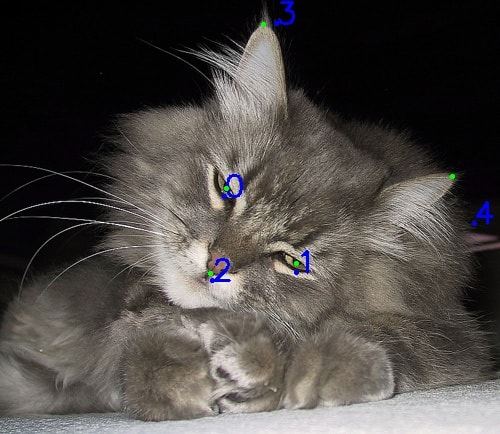
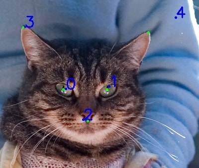
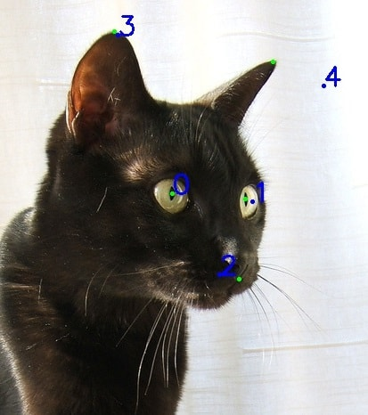
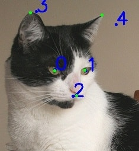

### Introduction

This repo is a fork of https://github.com/kairess/cat_hipsterizer. It contains a cat face
landmark predictor, which I was looking for to use in a project.

I added some routines to assess the performance of the predictor and I made it use
[an improved version of the data](https://github.com/zylamarek/cat-dataset).

The predictor consists of two models stacked on each other. The first one predicts the ROI (bounding box)
and the second one detects landmarks inside the ROI. The detected landmarks are then translated into the original image.
In the original project the author doesn't use a test dataset. To provide a baseline for improving this predictor
I did a rather limited hyperparameter search and trained both models on the augmented data. All the results below
are based on these two models.

Images below show examples of predicted landmarks (ordered by prediction accuracy, best on the left).
Ground truth landmarks are presented in green and predicted landmarks in blue. Landmarks are labeled: 0 - right eye,
1 - left eye, 2 - mouth, 3 - right ear, 4 - left ear.

[](./images/correct.png)
[](./images/close.png)
[](./images/rotated.png)
[](./images/incorrect.png)

An attempt to improve performance of the predictor resulted in this [project](https://github.com/zylamarek/frederic).

### Results

**An average error of each landmark along any axis is 6.85 pixels or 4.8% of a cat face size.**

The first table presents the performance of the whole pipeline. MAE and RMSE values are expressed in pixels,
MSE in pixels squared, MAPE and RMSPE in percent.
Percentage values were obtained by dividing each error by the length of the longer edge of
the bounding box of the given face.

Whole pipeline | train | validation | test
--- | --- | --- | ---
MAE | 7.14 | 7.47 | **6.85**
MSE | 176.24 | 223.22 | 238.58
RMSE | 13.28 | 14.94 | 15.45
RMSPE | 10.23 | 11.91 | 17.01
MAPE | 4.34 | 4.64 | **4.80**
MAPE eyes | 2.54 | 2.86 | 3.07
MAPE mouth | 3.83 | 4.62 | 4.67
MAPE ears | 6.39 | 6.44 | 6.59

Images below show examples of predicted landmarks with MAPE close to 4.8 (close to average error of the whole pipeline).
Ground truth landmarks are presented in green and predicted landmarks in blue. Landmarks are labeled: 0 - right eye,
1 - left eye, 2 - mouth, 3 - right ear, 4 - left ear.

[](./images/4.510377037_CAT_06_00001330_017.jpg)
[](./images/4.615848906_CAT_06_00001336_005.jpg)
[](./images/4.781478952_CAT_05_00001117_003.jpg)
[](./images/4.800832019_00001429_017.jpg)

The table below depicts results of the bounding box (ROI) prediction model. MSE, RMSE and MAE were computed for
two points: top-left and bottom-right corner of the bounding box. Intersection over union (IoU) of
the predicted and ground truth boxes is presented in percent.

Bounding box | train | validation | test
--- | --- | --- | ---
IoU | 67.11 | 71.08 | **71.35**
MAE | 6.71 | 8.56 | 8.57
MSE | 67.31 | 148.84 | 148.41
RMSE | 8.20 | 12.20 | 12.18

The last table shows the performance of the landmarks-inside-ROI predictor. The scores were computed using
the ground truth bounding boxes.

Landmarks | train | validation | test
--- | --- | --- | ---
MAE | 1.77 | 3.58 | **3.58**
MSE | 6.49 | 34.99 | 39.88
RMSE | 2.55 | 5.92 | 6.32

### Reproducing results

To obtain the above results you should first get a copy of [augmented cat-dataset](https://github.com/zylamarek/cat-dataset). Then run:

```
python preprocess.py
python preprocess_predict_bbox.py
python preprocess_lmks_pred.py
python preprocess_lmks.py
python test_predictor.py
python test_separately.py
```

Adjust the data path in the scripts if necessary.
